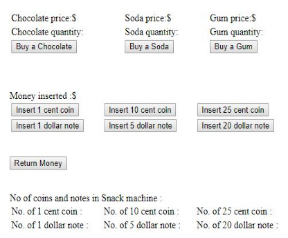

The first thing is that we have two automated machines.
- a nack machine
- an automated teller machine - ATM

The below image describes the interface of a snack machine.

Belows are some steps of our domain.
1. Our task is to model the snack machine so that it can sell snacks in exchange for cash.

    What we are going to focus on is the actual business logic behind the device, what rules it should follow when dealing with taking money in, returning change, selling products, and so on.

    Snack machine will have three slots for snacks.
    -   

2. 

3. 

4. 