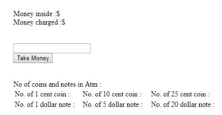
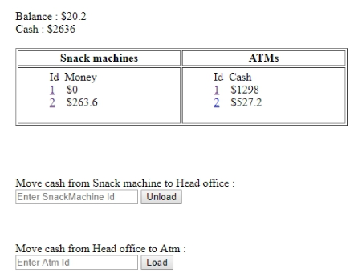

The first thing is that we have two automated machines.
- a nack machine
- an automated teller machine - ATM

Belows are some steps of our domain.
1. Our task is to model the snack machine so that it can sell snacks in exchange for cash.

   The below image describes the interface of a snack machine.

   
   
    What we are going to focus on is the actual business logic behind the device, what rules it should follow when dealing with taking money in, returning change, selling products, and so on.

    Snack machine will have three slots for snacks.
    - One slot contains chocolates.
    - 2nd slot contains cans of soda.
    - 3rd slot contains gums.
    
    The amount of money a user inserted in snack machine is displayed in the **Money inserted section**.
    
    We can insert only:
    - 1 cent coins
    - 10 cent coins
    - 25 cent coins
    - 1 dollar notes
    - 5 dollar notes

    In order to buy something, we need to insert a coin or a note and select which product we want to buy by pressing on one of these three buttons.
    - Buy a chocolate
    - Buy a soda
    - Buy a gum
    
    Then, we have that we will insert in three $1 notes, and press on **Buy a chocolate** button. After that, the number of chocolates is decreased by one.

2. Another task we will have is modelling the work of an ATM.

    
   
   In this ATM machine, a user can withdraw some cash from the bank account with a small fee.

   For example:
   - We can enter $1 in the text field. 
   - Press **Take Money** button, the number of $1 notes inside the ATM is decreased.
   
3. Head office

   

   We will need **Head office** to move the accumulated cash from ATMs to snack machines, and also keep a record of the balance we have of all charges made by our ATMs.