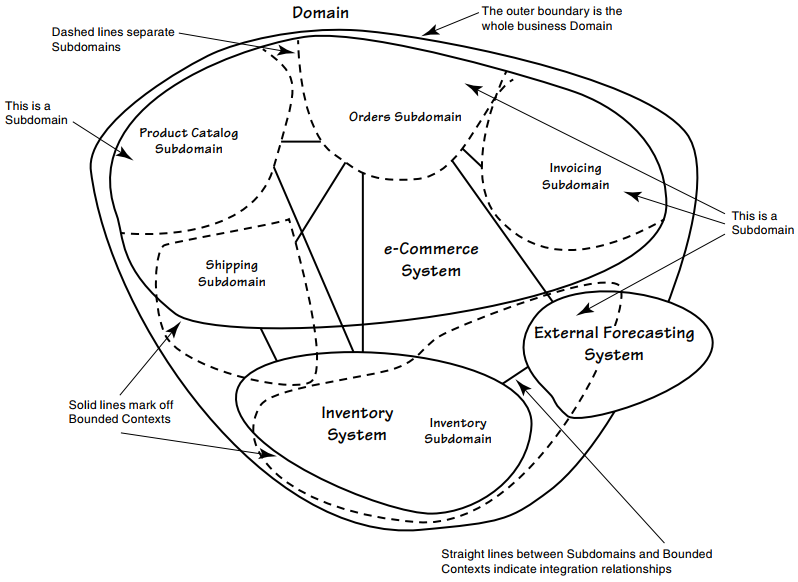

## Problems

Think of a retail company that sells products online. The products it sells could be just about anything, so we won't think too carefully about them.

To do business in this Domain, the company must present a catalog of products to shoppers, it must allow orders to be placed, it must collect payment for the products sold, and it must ship the products to buyers.

This online retailer's Domain seems to be composed of these four primary Subdomains:
- Product catalog
- Orders
- Invoicing
- Shipping

